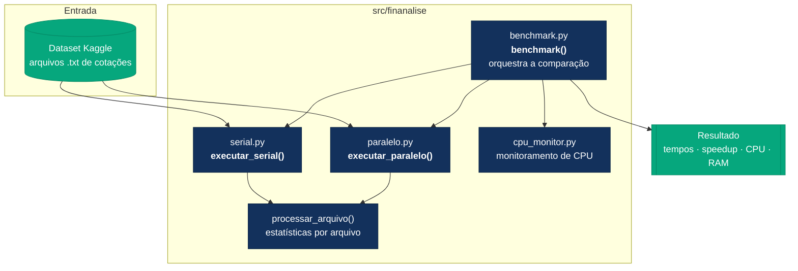
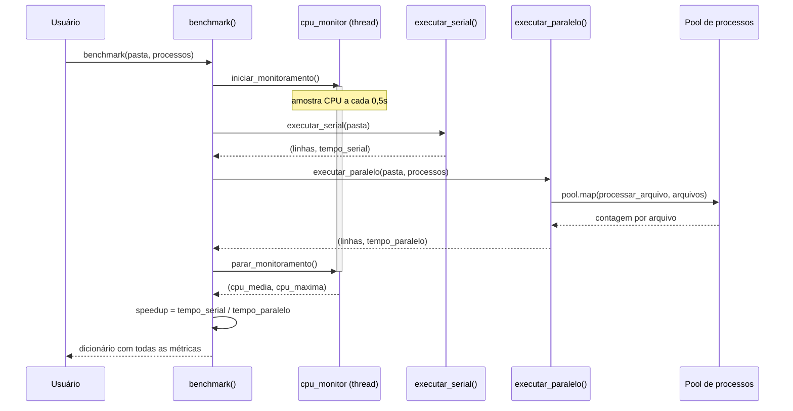
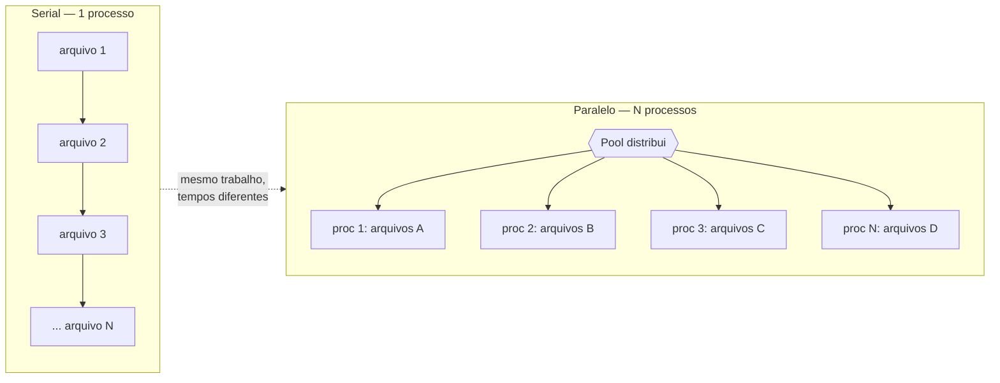
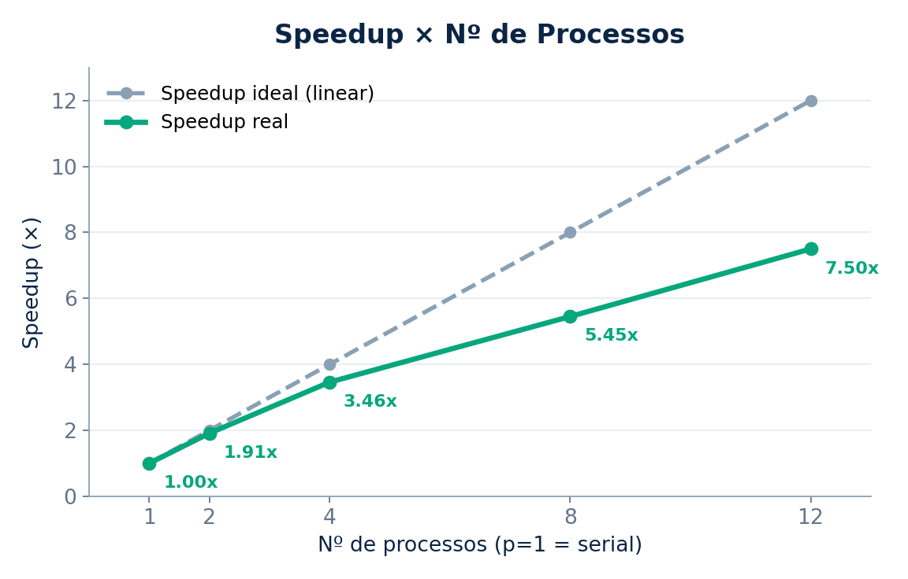
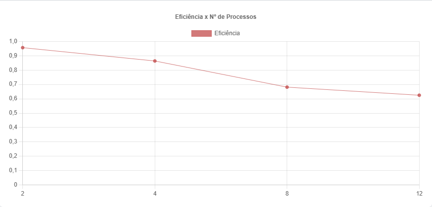
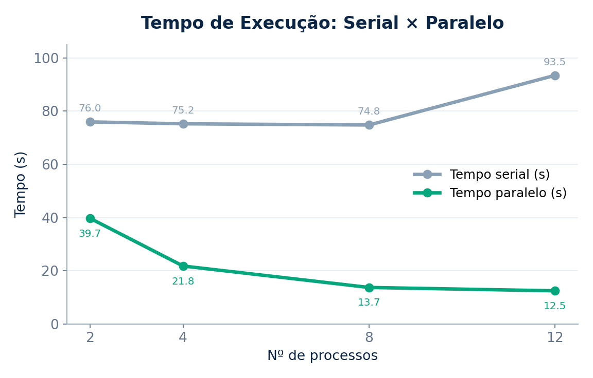

# 📊 Análise de Histórico Financeiro com Processamento Paralelo

> Processamento de **~35 milhões de registros** do mercado financeiro comparando execução **sequencial** e **paralela** em Python, com medição de *speedup*, eficiência, uso de CPU e memória.

<p>
  
  
  
  
</p>

**Disciplina:** Programação Concorrente e Distribuída · **Turma:** ADSN04 · **Professor:** Rafael
**Autores:** Caio Vinicius da Silva Vilanova (83420) e Matheus Nery Walkowicz (077651)

---

## 📑 Índice

- [Visão geral](#-visão-geral)
- [O problema (as dores)](#-o-problema-as-dores)
- [A solução](#-a-solução)
- [Para quem é este sistema](#-para-quem-é-este-sistema)
- [Arquitetura](#-arquitetura)
- [Como funciona (fluxo de execução)](#-como-funciona-fluxo-de-execução)
- [Detalhamento das funções](#-detalhamento-das-funções)
- [Estrutura de diretórios](#-estrutura-de-diretórios)
- [Dataset](#-dataset)
- [Instalação](#-instalação)
- [Como executar](#-como-executar)
- [Resultados experimentais](#-resultados-experimentais)
- [Análise dos resultados](#-análise-dos-resultados)
- [Limitações e trabalhos futuros](#-limitações-e-trabalhos-futuros)
- [Licença](#-licença)

---

## 🔎 Visão geral

Este projeto lê milhares de arquivos de cotações históricas (ações e ETFs) e, para cada arquivo, calcula estatísticas descritivas sobre preço de fechamento e volume negociado. O mesmo trabalho é feito de duas formas:

1. **Sequencial** — um único processo percorre todos os arquivos, um a um.
2. **Paralela** — os arquivos são distribuídos entre vários processos (`multiprocessing`), que trabalham simultaneamente.

Ao final, o sistema compara os tempos das duas abordagens e reporta **speedup**, **eficiência**, **uso médio/máximo de CPU** e **consumo de memória**, permitindo enxergar na prática os ganhos — e os limites — do paralelismo.

---

## 😣 O problema (as dores)

Processar grandes volumes de dados financeiros de forma sequencial é **lento e subutiliza o hardware**. Em uma máquina com 8 núcleos físicos (16 threads), a execução serial usa essencialmente **um único núcleo**, deixando os demais ociosos.

As dores concretas que o produto resolve:

| Dor | Impacto no negócio |
| --- | --- |
| **Tempo até o insight** | Varrer ~35M de registros em série leva **mais de um minuto** por rodada, atrasando análises e decisões. |
| **Custo de infra desperdiçado** | Apenas ~10% da CPU é usada no modo serial; 7 de 8 núcleos ficam ociosos — capacidade paga e não aproveitada. |
| **Escalabilidade ruim** | Conforme o volume de dados cresce, o tempo cresce linearmente e o pipeline não acompanha. |
| **Falta de visibilidade** | Sem instrumentação, não há métricas de desempenho e custo para saber onde está o gargalo. |

O objetivo é **reduzir o tempo de processamento** distribuindo a carga entre processos e, ao mesmo tempo, **medir objetivamente** o ganho com métricas de speedup, eficiência, CPU e RAM.

---

## ✅ A solução

A carga é naturalmente paralelizável: cada arquivo é independente dos demais, então pode ser processado em qualquer ordem, por qualquer processo. A solução usa um **pool de processos** que mapeia a função de processamento sobre a lista de arquivos:

- Cada processo lê um arquivo, calcula as estatísticas e devolve a contagem de linhas.
- O processo principal soma os resultados e mede o tempo total.
- Uma *thread* paralela amostra o uso de CPU durante toda a execução, sem interferir no processamento.

Como o trabalho é dividido entre N processos, o tempo total cai de forma próxima a `T_serial / N` — limitado, na prática, por I/O de disco, criação de processos e pela [Lei de Amdahl](https://pt.wikipedia.org/wiki/Lei_de_Amdahl).

---

## 👥 Para quem é este sistema

Pensado como **produto comercial** para quem processa grandes volumes de dados de mercado:

- **Fintechs e corretoras** — que ingerem e processam históricos de cotações em escala, diariamente.
- **Fundos quantitativos e gestoras** — que rodam *backtesting* e análises sobre o histórico de milhares de ativos.
- **Times de dados e engenharia em finanças** — que precisam de ETL rápido de grandes bases de arquivos (CSV/TXT) sem inflar custo de infraestrutura.

---

## 🏛 Arquitetura

O sistema é organizado em módulos com responsabilidade única dentro do pacote `src/finanalise`:



Cada módulo tem um papel claro:

| Módulo | Responsabilidade |
| --- | --- |
| `serial.py` | Processamento sequencial dos arquivos. |
| `paralelo.py` | Processamento paralelo via pool de processos. |
| `cpu_monitor.py` | Amostragem do uso de CPU em *thread* separada. |
| `benchmark.py` | Orquestra serial + paralelo + monitoramento e calcula as métricas. |

---

## ⚙️ Como funciona (fluxo de execução)

A função `benchmark()` coordena toda a comparação. O diagrama abaixo mostra a ordem das chamadas:



A diferença essencial entre serial e paralelo está em **como** os arquivos são percorridos:



---

## 🧩 Detalhamento das funções

### `serial.py`

#### `processar_arquivo(caminho)`
Lê um arquivo de cotações e calcula estatísticas descritivas.

- **Parâmetros:** `caminho` *(str)* — caminho completo do arquivo `.txt`.
- **O que faz:** abre o arquivo com `pandas.read_csv` e, sobre as colunas `Close` (fechamento) e `Volume`, calcula agregações como média, desvio-padrão, máximo, mínimo e soma. Toda a leitura é protegida por `try/except`, de modo que um arquivo inválido não interrompe a execução.
- **Retorno:** *(int)* número de linhas (registros) processadas no arquivo; `0` em caso de erro.

#### `executar_serial(pasta)`
Percorre **toda** a pasta de dados sequencialmente.

- **Parâmetros:** `pasta` *(str)* — diretório-raiz do dataset.
- **O que faz:** usa `os.walk` para encontrar todos os arquivos `.txt`, chama `processar_arquivo` para cada um, **um de cada vez**, e cronometra o trabalho com `time.perf_counter()`.
- **Retorno:** tupla `(total_linhas, tempo)` — total de registros e tempo total em segundos.

### `paralelo.py`

#### `processar_arquivo(caminho)`
Idêntica à versão serial — é a unidade de trabalho executada por cada processo do pool. Mantê-la em nível de módulo é o que permite que o `multiprocessing` a serialize (pickle) e a distribua entre os processos.

#### `executar_paralelo(pasta, processos)`
Versão paralela da varredura.

- **Parâmetros:** `pasta` *(str)* — diretório do dataset; `processos` *(int)* — número de processos do pool.
- **O que faz:** primeiro coleta a lista de todos os arquivos `.txt` com `os.walk`; em seguida cria um `Pool(processes=processos)` e usa `pool.map(processar_arquivo, arquivos)` para processá-los **em paralelo**; por fim soma as contagens devolvidas por cada processo. O tempo é medido com `time.perf_counter()`.
- **Retorno:** tupla `(total_linhas, tempo)`.

### `cpu_monitor.py`

Mantém estado global (`cpu_usos`, `monitorando`) e roda a amostragem em uma *thread daemon*, para medir a CPU **sem bloquear** o processamento.

#### `monitorar_cpu()`
Laço que, enquanto `monitorando` for verdadeiro, registra `psutil.cpu_percent()` a cada 0,5 s.

#### `iniciar_monitoramento()`
Zera o histórico, ativa o monitoramento e inicia a *thread* de amostragem. **Retorna** o objeto `Thread`.

#### `parar_monitoramento()`
Encerra o laço e **retorna** a tupla `(cpu_media, cpu_maxima)` arredondada; devolve `(0, 0)` se nenhuma amostra foi coletada.

### `benchmark.py`

#### `benchmark(pasta, processos)`
Orquestra o experimento completo.

- **Parâmetros:** `pasta` *(str)*, `processos` *(int)*.
- **O que faz:** inicia o monitoramento de CPU, executa a versão serial, em seguida a paralela, encerra o monitoramento, calcula `speedup = tempo_serial / tempo_paralelo` e coleta o uso de memória via `psutil`.
- **Retorno:** dicionário com as chaves:

  | Chave | Significado |
  | --- | --- |
  | `linhas` | total de registros processados |
  | `tempo_serial` | tempo da execução sequencial (s) |
  | `tempo_paralelo` | tempo da execução paralela (s) |
  | `speedup` | razão `tempo_serial / tempo_paralelo` |
  | `cpu_media` / `cpu_maxima` | uso de CPU médio e máximo (%) |
  | `ram_gb` / `ram_percent` | memória usada em GB e em % |
  | `nucleos` | número de núcleos lógicos da máquina |

---

## 🗂 Estrutura de diretórios

```
analise-historico-financeiro/
├── src/
│   └── finanalise/
│       ├── __init__.py
│       ├── serial.py        # processar_arquivo, executar_serial
│       ├── paralelo.py      # processar_arquivo, executar_paralelo
│       ├── cpu_monitor.py   # iniciar/parar/monitorar CPU
│       └── benchmark.py     # benchmark() — orquestração
├── imagens/                 # gráficos dos resultados
│   ├── grafico1.png         # speedup
│   ├── grafico2.png         # eficiência
│   └── grafico3.png         # tempo de execução
├── requirements.txt
└── README.md
```

---

## 📦 Dataset

Os dados vêm do **Huge Stock Market Dataset** (Kaggle): milhares de arquivos `.txt`, um por ativo (ações e ETFs), com colunas `Date, Open, High, Low, Close, Volume, OpenInt`. No total, **~34,9 milhões de registros** são processados a cada rodada.

> Baixe o dataset do Kaggle e aponte a pasta de dados ao executar o benchmark. Apenas as colunas `Close` e `Volume` são usadas nos cálculos.

---

## 🚀 Instalação

Requer **Python 3.11+** (testado em 3.14).

```bash
# clonar o repositório
git clone https://github.com/Caio-Vilanova/analise-historico-financeiro.git
cd analise-historico-financeiro

# (opcional) ambiente virtual
python -m venv .venv
source .venv/bin/activate        # Windows: .venv\Scripts\activate

# dependências
pip install -r requirements.txt
```

Dependências (`requirements.txt`): `pandas`, `psutil`, `matplotlib`, `kaggle`.

---

## ▶️ Como executar

Chame `benchmark()` apontando para a pasta do dataset e o número de processos desejado:

```python
from src.finanalise.benchmark import benchmark

resultado = benchmark("caminho/para/dataset", processos=8)

print(f"Tempo serial:   {resultado['tempo_serial']:.2f} s")
print(f"Tempo paralelo: {resultado['tempo_paralelo']:.2f} s")
print(f"Speedup:        {resultado['speedup']:.2f}x")
print(f"CPU média/máx:  {resultado['cpu_media']}% / {resultado['cpu_maxima']}%")
print(f"RAM usada:      {resultado['ram_gb']} GB")
```

Para reproduzir a tabela de resultados, rode o benchmark variando `processos` em `2, 4, 8, 12`.

---

## 📈 Resultados experimentais

Ambiente: **Intel Xeon E5-2640 v3** (8 núcleos / 16 threads), 16 GB RAM, Windows 11, Python 3.14.

| Processos | Registros | Tempo serial (s) | Tempo paralelo (s) | Speedup | CPU média | CPU máxima | RAM |
| :-: | :-: | :-: | :-: | :-: | :-: | :-: | :-: |
| 2 | 34.906.486 | 75,96 | 39,71 | **1,91x** | 10,91% | 18,9% | 11,46 GB |
| 4 | 34.906.486 | 75,24 | 21,78 | **3,46x** | 13,01% | 30,7% | 11,50 GB |
| 8 | 34.906.486 | 74,79 | 13,72 | **5,45x** | 16,89% | 66,5% | 11,27 GB |
| 12 | 34.906.486 | 93,45 | 12,46 | **7,50x** | 15,40% | 100,0% | 11,55 GB |

> A execução serial é independente do número de processos (é sempre a mesma varredura de um único processo). A oscilação para **93,45 s** na última linha reflete ruído do sistema durante aquela rodada — o restante fica em torno de **~75 s**.

> 📌 Nos gráficos abaixo, **`p = 1` representa a execução serial** (baseline): tempo = tempo serial, **speedup = 1,00×** e **eficiência = 100%**. A partir de `p = 1`, a curva paralela acompanha naturalmente os demais pontos (2, 4, 8, 12).

### Speedup



A linha pontilhada é o **speedup ideal** (linear, `speedup = nº de processos`); a linha cheia é o speedup **real** obtido.

### Eficiência



Eficiência = `speedup / nº de processos × 100%`. Mede o quanto cada processo é aproveitado.

### Tempo de execução



---

## 🧠 Análise dos resultados

- O tempo paralelo cai de forma expressiva: de **~76 s** (serial) para **12,46 s** com 12 processos — **speedup de 7,50×**.
- A **eficiência diminui** conforme `p` cresce (de ~95,5% com 2 processos para ~62,5% com 12). Isso é esperado: o overhead de criar/gerenciar processos e o I/O de disco passam a pesar mais.
- A **CPU máxima chega a 100%** com 12 processos, mostrando que o sistema passou a explorar todos os núcleos disponíveis.
- O **consumo de memória se mantém estável** (~11,5 GB) em todas as configurações.

Em resumo, o paralelismo entrega ganhos reais e significativos, mas com **retornos decrescentes** — a distância entre o speedup real e o ideal aumenta com o número de processos, exatamente como prevê a Lei de Amdahl.

### 🎯 Número ideal de processos

Para esta carga e este hardware (**8 núcleos físicos** / 16 threads), o ponto ideal fica em **até 8 processos**:

- **8 processos** é o ponto mais rápido e equilibrado: casa com o número de **núcleos físicos** da máquina e entrega o melhor aproveitamento (eficiência) — o tempo já está próximo do mínimo prático.
- De **8 → 12** o ganho é **marginal** (de 13,72 s para 12,46 s, ~1,3 s) e a eficiência **cai** (68,1% → 62,5%): gasta-se mais processos para ganhar pouco.
- **Acima de 12**, ao ultrapassar a capacidade real de paralelismo da máquina (*oversubscription*), o overhead de criação/troca de contexto e o I/O passam a dominar e a aplicação tende a ficar **mais lenta**.

> **Recomendação:** use um número de processos próximo ao de núcleos físicos (**≈ 8**). Mais que isso traz retornos decrescentes e, além de ~12, perda de desempenho.

### Fatores limitantes

- Leitura de grandes volumes de arquivos (I/O de disco).
- Sobrecarga de criação e gerência de processos.
- Comunicação/serialização entre processos (`pickle`).
- Fração inerentemente sequencial do trabalho (Lei de Amdahl).

---

## 🔭 Limitações e trabalhos futuros

- Avaliar `chunksize` no `pool.map` para reduzir overhead de distribuição.
- Testar leitura em streaming / por *chunks* do pandas para arquivos muito grandes.
- Comparar com `ProcessPoolExecutor` e com abordagens baseadas em I/O assíncrono.
- Exportar os resultados automaticamente para CSV e gerar os gráficos por script.

---

## 📄 Licença

Projeto acadêmico desenvolvido para a disciplina de Programação Concorrente e Distribuída (ADSN04). Uso livre para fins educacionais.
